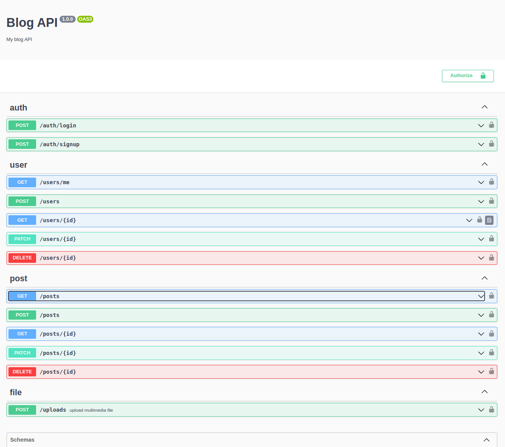

# Server 'Blog'.

> Database with authorization, CRUD users and posts. Upload files to the server.


---

[Description](#description) •
[Project setup](#project-setup) •
[Features](#features) •
[How To Use](#how-to-use) •
[Project Status](#project-status) •
[Room for Improvement](#room-for-improvement) •
[License](#license) •
[Contact](#contact)



## Description

Database with authorization and with the ability to add, delete and edit posts. The ability to add multimedia files to posts.

## Project setup

- Clone this repo to your desktop and run ```yarn``` or ```npm install``` to install all the dependencies.
- connect db (inject variables into .env file)
- Once the dependencies are installed, you can run ```yarn dev``` or ```npm dev``` to start the application.
- Enjoy.

## Features
- CRUD with authorization.
- Load images to server.
- The ability to edit and delete only your posts.

## How To Use

Run [Live Demo](https://express-typeorm-blog.onrender.com/swagger/)

1. Create user
2. Login with created user
3. Сreate post.
4. Add multimedia file (image, mp3, video) to post.
5. Нou can see data about yourself and your posts along the route ```get_me```

## Project Status

Project is: *in progress*

## Room for Improvement

To do:
- [ ] Add refresh token
- [ ] Add admin and user rights

Improvement:
- [ ] Add Next client

## License

This project is open source and available under the [MIT](../LICENSE).

## Contact
Created by [@RimidalU](https://www.linkedin.com/in/uladzimir-stankevich/) - feel free to contact me!

<p align="right"><a href="#start"></a></p>

<!-- MARKDOWN LINKS & IMAGES -->

